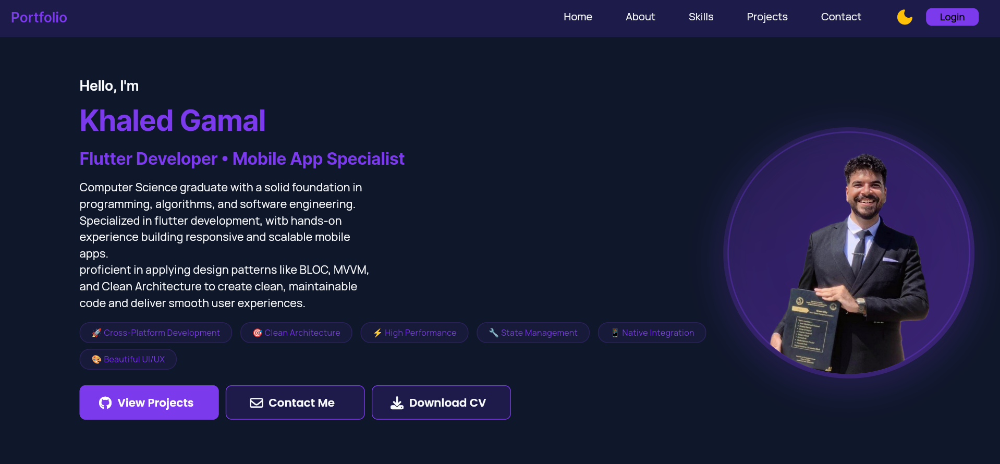
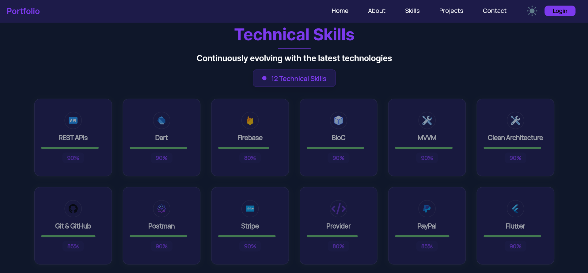
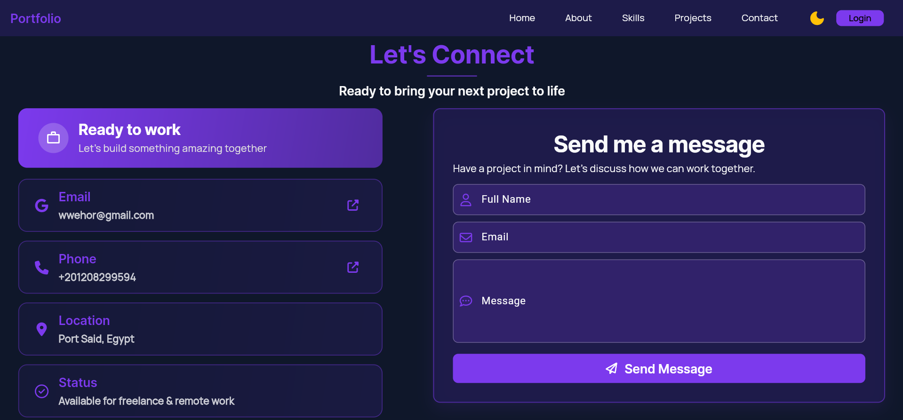

# 🌐 Khaled Gamal — Portfolio Website

Welcome to my personal **Flutter Web Portfolio**, built with ❤️ using **Flutter + Supabase**.  
It showcases my projects, skills, and experience as a **Flutter Developer**.

## 🚀 Live Demo

🔗 [View Portfolio](https://khaled21120.github.io/portfolio-flutter/)

---

## 🧰 Tech Stack

- **Flutter Web** — for a fast, responsive, and elegant UI
- **Supabase** — backend for contact form and dynamic content
- **Cubit (Bloc)** — for clean, maintainable state management
- **MVVM Architecture** — scalable and modular app structure

---

## 📸 Screenshots

| Home                          | Skills                            | Contact                             |
| ----------------------------- | --------------------------------- | ----------------------------------- |
|  |  |  |

---

## 📬 Contact Me

- 📧 **Email:** [wwehor@gmail.com](mailto:wwehor@gmail.com)
- 💼 **LinkedIn:** [Your LinkedIn Profile](https://www.linkedin.com/in/khaled-gamal-k/)
- 🐙 **GitHub:** [Your GitHub Profile](https://github.com/khaled21120/)

---

## 🧾 Features

✅ Fully responsive across Desktop, Tablet, and Mobile  
✅ Smooth navigation between sections  
✅ Contact form powered by **Supabase**  
✅ Dark & Light themes  
✅ Modern and minimalist design

---

## 🧠 Lessons Learned

- Implementing responsive layouts using **ScreenUtil** and **MediaQuery**
- Structuring scalable Flutter Web apps with **MVVM + Cubit**
- Integrating **Supabase** for backend and real-time database
- Optimizing for **performance and accessibility** on web

---
